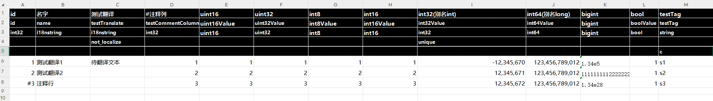
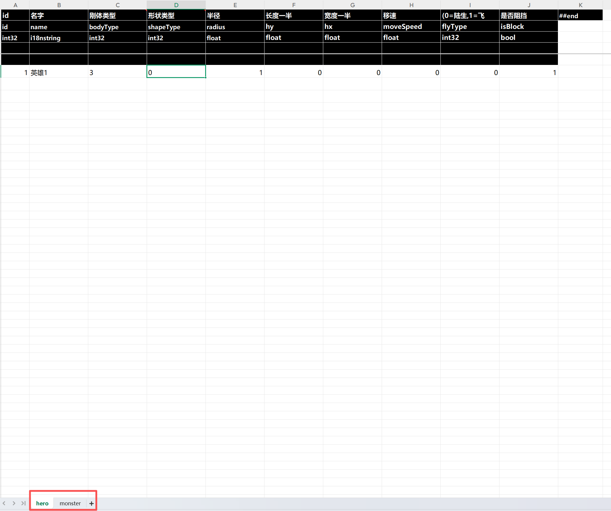

## Table of Contents

[toc]

## 构建

- 依赖项

  - 大于等于python3.10
  - pip install pyinstaller
  - pip install openpyxl
- 仅对程序有用,当工具代码改变后,需要重新构建时执行
- 执行 build_exe.bat

[Back to TOC](#table-of-contents)

## 用法

双击 gen.bat

[Back to TOC](#table-of-contents)

## 配置

### --config

配置文件名

- input
  - 必填
  - 含义: 输入路径(excel 存放路径)
- output
  - 必填
  - 含义: 输出路径(生成配置路径)
- genHeader
  - 可选
  - 含义: 头部是否包含各字段描述信息
  - 格式: genHeader = true/false
- genHeaderDetail
  - 可选
  - 含义: 头部是否包含各字段备注信息
  - 格式: genHeaderDetail = true/false
- outputFormats
  - 可选
  - 含义: 输出格式列表,支持 lua/luacvs/csharp/py/json/binary
- defaults
  - 可选
  - 含义: 各类型默认值,没指定为该类型的默认值
  - 格式: defaults = {"类型名":默认值}
- tags
  - 可选
  - 含义: [导出的 tag 列,不填所有列都导出,比如可以自定义 client/server 等 tag]
  - 格式: tags=[tag1,tag2,tag3,...]
- i18nDirectory
  - 可选
  - 含义: 国际化翻译目录
- i18nLanguage
  - 可选,如果不指定表示国际化文本不翻译也不导出,i18nDirectory+i18nExtension 必须同时指定
  - 含义: 国际化翻译语言
  - 命名规范
    language[_script]
    language 符合 ISO_639 语言编码,script 为语言变体,可选字段,比如:
    en=英文
    zh_Hans=简体中文
    zh_Hant=繁体中文
- i18nExtension
  - 可选
  - 含义: 国际化文件格式,目前支持 **.po**和**.txt** 和 **.lua**,默认为 **.po**
- i18nSeperator
  - 可选
  - 含义: 分割符,对于.txt 格式翻译文本有效,默认为<:>
- localize
  - 可选
  - 含义: true=对 i18nstring 类型字符串翻译为目标语言文本
- pretty
  - 可选
  - 含义: true=美化导出配置,false=每行配置导出一行,这样不美观,但输出配置文件占用尺寸小
- exclude
  - 可选
  - 含义: 排除的配表文件列表
  - 格式: [文件名 1,文件名 2,...]
- merge
  - 可选
  - 含义: 合并配表
  - 格式: {
    合并到的文件名 : [来源文件名 1,来源文件名 2]
    }

### --onlyExportChange

仅导出 svn 变动的 Excel

[Back to TOC](#table-of-contents)

## 表头行定义

- excel 表头前 5 行用于数据描述定义
- 每行含义
  - 1=备注行
  - 2=名字行
  - 3=类型行
  - 4=约束行
  - 5=标签行,比如脚本可以控制导出带特定标签的列

## 注释行

对行第一列元素前增加#即可

[Back to TOC](#table-of-contents)

## 数据类型

- bool: 取值范围 0/1
- int8
  - 取值范围: 8 位有符号 int
- int16
  - 取值范围: 16 位有符号 int
- int32
  - 取值范围: 32 位有符号 int
  - 别名: int
- int64
  - 取值范围: 64 位有符号 int
  - 别名: long
- uint8
  - 取值范围: 8 位无符号 int
- uint16
  - 取值范围: 16 位无符号 int
- uint32
  - 取值范围: 32 位无有符号 int
- uint64
  - 取值范围: 64 位无符号 int
- bigint
  - 大数
  - 举例: 3.14e3 => 3.14 \* 10^3 => 3140
- float
  - 单精度浮点数
- double
  - 双精度浮点数
- string
  - 字符串(不参与翻译)
- i18nstring
  - 国际化字符串(同 string,可用于标记该列文本会被国际化导出,如果配置 localize=true,导出会自动翻译为目标语言文本,如果没提供本地化文本,则保持原始文本串,你也可以打 not_localize 约束强制该列不导出成目标语言文本)
  - 别名: lang
- bit32
  - 32 位掩码类型,数据格式固定为: [0,1,2],最终结果会自动转换为 int32,值为 2^0+2^1+2^2
  - 别名: bit
- bit64
  - 64 位掩码类型,数据格式固定为: [0,1,2],最终结果会自动转换为 int32,值为 2^0+2^1+2^2
- json
  - json 类型
- list
  - 动态数组
  - 格式: list `<type>`,其中 type 为元素类型,支持嵌套
- map
  - 字典
  - 格式: map<keytype,valuetype>,其中 keytype 为键类型,valuetype 为值类型,支持嵌套

[Back to TOC](#table-of-contents)

## 约束

- 格式: k1=v1;k2=v2
- 描述: 所有约束都是可选的
- 约束类型
  - min
    - 可取的最小值
    - 格式: min=最小值
  - max
    - 可取的最大值
    - 格式: max=最大值
  - limit
    - 限制取值集合
    - 格式: limit=[值 1,值 2,值 3]
  - ref
    - 引用表的某列字段
    - 格式: ref=表名-字段名
  - unique
    - 唯一性约束,其中第一列(id 列)固定带 unique 约束,另外 unique 列自带 not_null 约束
  - convert
    - 转换
    - 格式: convert=转换函数名,转换函数可以在 Convert.py 文件中提供
  - default
    - 默认值,没指定时为对应类型的默认值
    - 格式:default=默认值
  - not_null
    - 此列无法为空
  - split
    - 根据此列值拆分表,此约束只允许出现在一列,拆分表名=表名\_$拆分列值
    - 格式: split=列 id(从 1 开始)/列名,比如 split=1 表示此列为拆分列,主键为第 1 列
  - .key
    - 含义: 指定 map 类型的 key 名,可以 map 类型字段拆分成多个单元格填
    - key 可以为任何有效标识符

[Back to TOC](#table-of-contents)

## 自定义类

可以提供**class**.xlsx 文件来定义类,类数据配置语法: [字段 1 数据,字段 2 数据,...],[]也可以用()代替,数据填充顺序需要和字段定义顺序保持一致。自定义的类字段类型不能为 json 类型

## 合并单元格

- 单例表不支持此功能

对于复杂 list/map 类型,我们可以把数据拆分成多个单元格填,该字段的描述/名字/类型合并单元格,单元格数量=数据列数,如此配置后,会将多个单元格数据合并后导出。目前合并单元格类型支持 list `<any>`/map<string,any>,对于 map 类型,我们可以在约束行填固定键名,格式:`.key`,我们也支持容器类型嵌套,比如 list<map<string,any>>,如果同时填了固定键名,那嵌套深度最大为 2

[Back to TOC](#table-of-contents)

## 注释

- 在行头增加 `#`能注释本行
- 在列头增加 `#`能注释本列
- 在列头填 `##end`表示本列及之后的列都不被导出
- 在首列头填 `##key`表示此 excel 为单例表,也就是以列模式来填表,此时首行为表头,格式固定为: ##key | type | value | tags | desc

[Back to TOC](#table-of-contents)

## 列表简化配置

列表是以逗号 `,`作为分隔符,工具允许列表省略掉 `最外层[]`

## 示例

- 导出配置见: config.json
- excel 示例配置
  - 多行表: Excel/template@模板.xlsx
    
  - 单例表: Excel/var@变量.xlsx
    
  - 单个excel根据sheet名导出多份数据，以下表会导出entity_hero和entity_monster数据
    

[Back to TOC](#table-of-contents)

## Liscense

MIT
